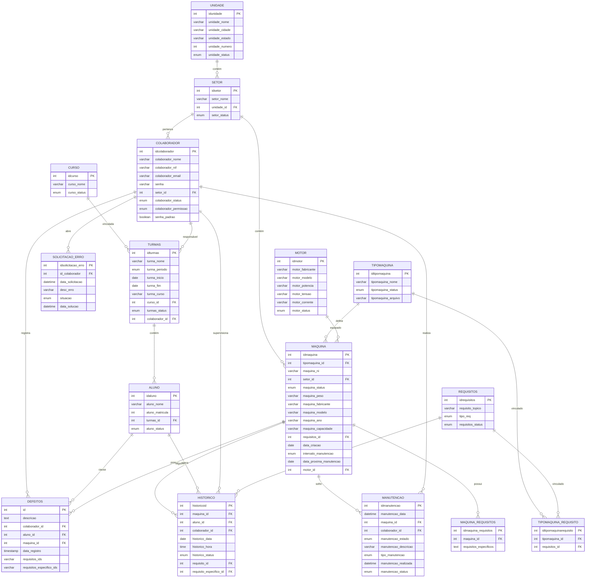

# Diagrama do Banco de Dados - NR12

Este documento descreve a estrutura do banco de dados `nr12`, incluindo suas tabelas, colunas, tipos de dados e relacionamentos.

## Modelo Entidade-Relacionamento (ER)

## Tabelas e Detalhes

### `aluno`
Armazena informações dos alunos matriculados nas turmas.

| Coluna | Tipo | Descrição |
|---|---|---|
| `idaluno` | int (PK) | Identificador único do aluno |
| `aluno_nome` | varchar(80) | Nome completo do aluno |
| `aluno_matricula` | int(9) | Número da matrícula |
| `turmas_id` | int (FK) | Referência à tabela `turmas` |
| `aluno_status` | enum | Ativo ou Inativo |

### `colaborador`
Armazena informações dos funcionários (Adm, Professores, Coordenadores).

| Coluna | Tipo | Descrição |
|---|---|---|
| `idcolaborador` | int (PK) | Identificador único do colaborador |
| `colaborador_nome` | varchar(99) | Nome do colaborador |
| `colaborador_nif` | varchar(15) | NIF do colaborador |
| `colaborador_email` | varchar(100) | E-mail corporativo |
| `senha` | varchar(255) | Senha criptografada (Argon2) |
| `setor_id` | int (FK) | Referência à tabela `setor` |
| `colaborador_status` | enum | Ativo ou Inativo |
| `colaborador_permissao` | enum | Adm, Coordenador, Manutencao, Professor |
| `senha_padrao` | tinyint(1) | Flag para troca de senha obrigatória |

### `maquina`
Armazena informações detalhadas de cada máquina.

| Coluna | Tipo | Descrição |
|---|---|---|
| `idmaquina` | int (PK) | Identificador único da máquina |
| `tipomaquina_id` | int (FK) | Referência à tabela `tipomaquina` |
| `maquina_ni` | varchar(20) | Número de Inventário |
| `setor_id` | int (FK) | Referência à tabela `setor` |
| `maquina_status` | enum | Ativo ou Inativo |
| `maquina_peso` | varchar(255) | Peso da máquina |
| `maquina_fabricante` | varchar(50) | Fabricante |
| `maquina_modelo` | varchar(65) | Modelo |
| `maquina_ano` | varchar(4) | Ano de fabricação |
| `maquina_capacidade` | varchar(120) | Capacidade operacional |
| `requisitos_id` | int (FK) | Referência à tabela `requisitos` |
| `data_criacao` | date | Data de cadastro no sistema |
| `intervalo_manutencao` | enum | Frequência (3, 6, 12 meses) |
| `data_proxima_manutencao` | date | Próxima data prevista de manutenção |
| `motor_id` | int (FK) | Referência à tabela `motor` |

### `historico`
Registro de checagem e uso das máquinas.

| Coluna | Tipo | Descrição |
|---|---|---|
| `historicoid` | int (PK) | Identificador único |
| `maquina_id` | int (FK) | Máquina utilizada |
| `aluno_id` | int (FK) | Aluno que operou |
| `colaborador_id` | int (FK) | Professor presente |
| `historico_data` | date | Data da operação |
| `historico_hora` | time | Hora da operação |
| `historico_status` | enum | Checado ou Não checado |
| `requisito_id` | int (FK) | Requisito geral verificado |
| `requisito_especifico_id` | int (FK) | Requisito específico verificado |

### `manutencao`
Controle de manutenções preventivas e corretivas.

| Coluna | Tipo | Descrição |
|---|---|---|
| `idmanutencao` | int (PK) | Identificador único |
| `manutencao_data` | datetime | Data da solicitação |
| `maquina_id` | int (FK) | Máquina em manutenção |
| `colaborador_id` | int (FK) | Responsável pela manutenção |
| `manutencao_estado` | enum | Quebrado ou Consertado |
| `manutencao_descricao` | varchar(150) | Observações |
| `tipo_manutencao` | enum | Preventiva ou Corretiva |
| `manutencao_realizada` | datetime | Data da execução |
| `manutencao_status` | enum | Ativo ou Inativo |

### `requisitos`
Checklist de segurança e operação.

| Coluna | Tipo | Descrição |
|---|---|---|
| `idrequisitos` | int (PK) | Identificador único |
| `requisito_topico` | varchar(255) | Descrição do item de segurança |
| `tipo_req` | enum | Seguranca, Operacional, Preventivo |
| `requisitos_status` | enum | Ativo ou Inativo |

### `turmas`
Definição dos grupos de alunos.

| Coluna | Tipo | Descrição |
|---|---|---|
| `idturmas` | int (PK) | Identificador único |
| `turma_nome` | varchar(120) | Nome/Sigla da turma |
| `turma_periodo` | enum | Manhã, Tarde, Noite, Integral |
| `turma_inicio` | date | Início do curso |
| `turma_fim` | date | Término do curso |
| `curso_id` | int (FK) | Referência à tabela `curso` |
| `turmas_status` | enum | Ativo ou Inativo |
| `colaborador_id` | int (FK) | Professor responsável |

### `setor`
Divisões físicas da oficina.

| Coluna | Tipo | Descrição |
|---|---|---|
| `idsetor` | int (PK) | Identificador único |
| `setor_nome` | varchar(110) | Nome do setor (ex: Mecânica, Solda) |
| `unidade_id` | int (FK) | Unidade SENAI |
| `setor_status` | enum | Ativo ou Inativo |

---
*Gerado por Antigravity em 01/04/2026*
